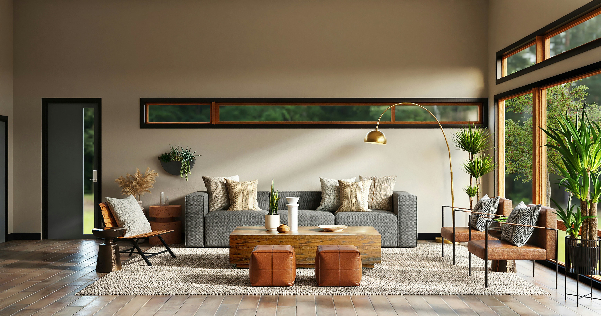

# KK Interiors — Bespoke Interior Architecture & Living

A modern, clean, and luxurious web showcase for **KK Interiors**, a premier interior architecture studio with over 23 years of design excellence.

---

## 🌟 Overview & Key Features

The website has been reimagined with high-end architectural aesthetics, warm tactile materiality, and interactive client-engagement tools.

### 🏛️ Architecture & Sections
- **Editorial Brand Identity**: Crafted with a deep obsidian (`#111215`), warm alabaster (`#f8f6f0`), and brushed champagne bronze (`#c5a059`) palette, pairing editorial serif typography (*Cormorant Garamond*) with modern geometric typography (*Plus Jakarta Sans*).
- **Cinematic Hero**: Full-bleed architectural photography with luxury vignetting, 23-year heritage badge, and quick credibility stat indicators.
- **Interactive Before & After Transformation Slider**: Draggable split-screen component enabling prospective clients to compare raw structural spaces against finished turnkey interiors.
- **Curated Selected Works (Portfolio)**: Real-time category filtering (`Living & Dining`, `Kitchens`, `Master Suites`, `Commercial`) with an interactive Project Detail Lightbox Modal showing photography, scope, and architectural concept.
- **Project Scope & Timeline Estimator**: Interactive planning tool that allows visitors to select property type, service scope, and finish tier to calculate estimated project timeline and deliverables.
- **Structured 4-Step Design Process**: Transparent roadmap detailing *Discovery & Spatial Audit*, *Schematic Design & 3D*, *Procurement & Millwork*, and *Turnkey Reveal & Styling*.
- **Client Testimonials & Press**: Verified homeowner reviews and industry accolades.
- **Interactive FAQ Accordion**: Expandable answers to common questions about consultations, timelines, and contractor supervision.
- **Consultation Studio & Booking**: Consultation request form with client-side validation, direct contact channels (phone, WhatsApp, email), and Google Maps integration for 13 Namagembe Close, Kampala.
- **Responsive Mobile Navigation**: Touch-friendly slide-down drawer menu with animated hamburger-to-close toggle.
- **Direct WhatsApp Quick Chat**: Floating action button with direct WhatsApp deep-link.

---

## 🛠️ Technology Stack

- **HTML5 & Vanilla JavaScript**: Zero runtime dependencies, lightweight, and blazingly fast.
- **Tailwind CSS**: Utility-first responsive design framework.
- **Google Fonts**: *Cormorant Garamond* (Editorial Serif) & *Plus Jakarta Sans* (Modern Sans-Serif).
- **Lucide Icons**: Crisp, scalable SVG vector iconography.
- **Curated Photography**: High-resolution architectural photography.

---

## 🚀 Deployment

This project is configured for continuous static deployment via **GitHub Actions** and **GitHub Pages**:
- Deployment workflow: `.github/workflows/static.yml`
- Commits pushed to `main` are automatically built and published to GitHub Pages.

---

## 📍 Studio Location & Contact

- **Address**: 13 Namagembe Close, Kampala, Uganda
- **Phone**: +256 787 618 537 / +256 777 568 893
- **Email**: hello@interiordesign.com
- **WhatsApp**: [+256 787 618 537](https://wa.me/256787618537)
